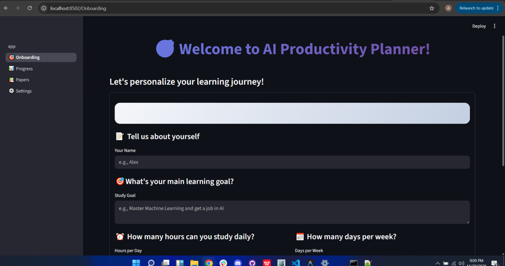
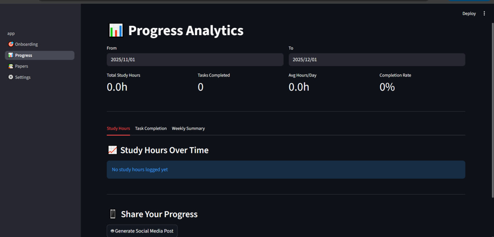
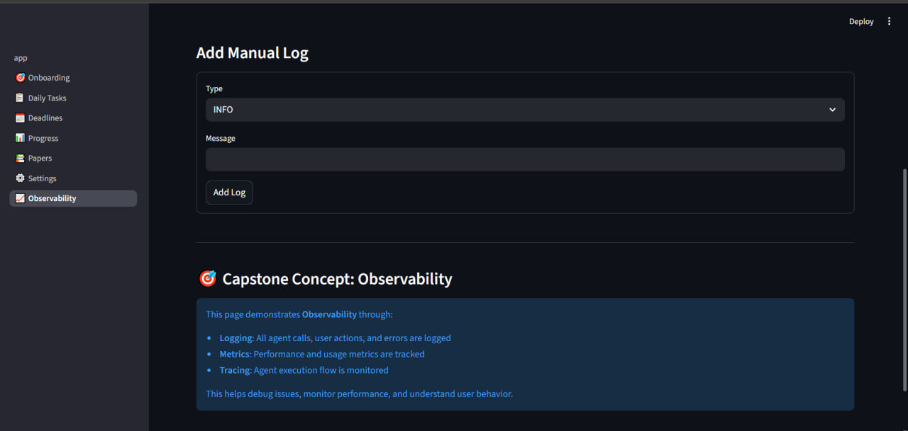

# 🎯 StudyMesh: AI Productivity Planner

**Tagline:** Your personal AI-powered command center for academic and professional growth.

**StudyMesh** is a sophisticated, multi-agent productivity planner designed to help students, researchers, and lifelong learners organize their work, track their progress, and accelerate their learning. It leverages the Google Agent Development Kit (ADK) and Gemini models to provide a suite of intelligent features, from personalized roadmap generation to AI-powered research assistance.

This project serves as a comprehensive showcase of a modern, agentic application built with cutting-edge tools.

## ✨ Feature Summary

- ** personalized Onboarding:** Creates a tailored study roadmap based on user goals, availability, and interests.
- **AI Task Management:** Manages daily, weekly, and long-term tasks with AI-powered suggestions.
- **Smart Deadline Tracking:** Automatically extracts deadlines and requirements from URLs or text descriptions.
- **Progress Analytics:** Visualizes study hours, task completion rates, and weekly progress.
- **AI-Powered Motivation:** Provides gamified streaks and AI-generated praise to keep users motivated.
- **Research Paper Feed:** Fetches and provides AI-generated summaries of the latest research papers from arXiv based on user interests.
- **AI Social Media Assistant:** Generates professional social media posts to share achievements.
- **End-to-End Observability:** Features a built-in dashboard for monitoring logs and application metrics.

## 🏛️ Architecture Overview

StudyMesh is built on a hierarchical, multi-agent architecture. A central **Orchestrator** agent delegates tasks to a team of specialized agents, each responsible for a specific domain.


### Core Components

- **Frontend:** A user-friendly web interface built with **Streamlit**, featuring custom CSS for a modern look and feel.
- **Agent System (Google ADK):**
    - **Orchestrator Agent:** The central coordinator (`productivity_orchestrator`). It understands user requests and routes them to the appropriate specialist.
    - **Specialist Agents:** A team of `LlmAgent` instances, each with a specific role:
        - `task_planner`: Creates learning roadmaps and tasks.
        - `research_agent`: Finds and summarizes academic papers.
        - `progress_analyst`: Analyzes user progress and provides insights.
        - `content_creator`: Drafts social media posts.
        - `deadline_parser`: Extracts structured data from unstructured text or URLs.
- **Tools / MCP (Model-Context-Protocol):** A set of services that provide agents with access to external resources:
    - `DatabaseMCP`: A safe, high-level interface for querying the application's SQLite database.
    - `FilesystemMCP`: A sandboxed tool for reading and writing files within a dedicated `documents` directory.
    - `WebScraperMCP`: A tool used by the `deadline_parser` to fetch and clean content from URLs.
- **Data Persistence:**
    - **Database (`SQLite`):** A local SQLite database (`planner.db`) stores all user data, including profiles, tasks, deadlines, progress, and more. The schema is defined in `database/schema.sql`.
    - **Database Manager:** The `DatabaseManager` class provides a comprehensive data access layer (DAL) for all database operations.
- **Session & Memory Management:**
    - `SessionManager`: Manages user sessions with the agent system using `google.adk.sessions.InMemorySessionService`. It includes a crucial synchronous wrapper (`run_agent_sync`) to bridge the gap between Streamlit's synchronous execution and the ADK's asynchronous nature, using `nest_asyncio`.
    - `MemoryManager`: A conceptual implementation of long-term memory, designed to analyze user behavior (like study patterns) and provide proactive recommendations.
- **Observability:**
    - `Logger`: A centralized logger using Python's standard `logging` module, configured to output to both the console and a `planner.log` file.
    - `MetricsCollector`: An in-memory service for tracking application metrics and counters (e.g., agent response times, feature usage).

## 🗂️ File Tree & Explanation

```
.
├── myenv/
├── screenshoots/
├── study_mesh/
├── error_log.txt
├── read_log.py
└── README.md
```

### study_mesh/
```
study_mesh/
├── .gitignore
├── app.py                  # Main Streamlit app entry point, user dashboard
├── requirements.txt        # Project dependencies
├── README.md               # This file
├── database/
│   ├── __init__.py
│   ├── db_manager.py       # Data Access Layer for all DB operations
│   └── schema.sql          # SQL schema for the SQLite database
├── pages/
│   ├── __init__.py
│   ├── 0_🎯_Onboarding.py    # User onboarding and initial roadmap generation
│   ├── 1_📋_Daily_Tasks.py   # UI for managing daily, weekly, and long-term tasks
│   ├── 2_📅_Deadlines.py     # UI for AI-powered deadline extraction and tracking
│   ├── 3_📊_Progress.py      # UI for progress analytics and social post generation
│   ├── 4_📚_Papers.py       # UI for finding, summarizing, and managing research papers
│   ├── 5_⚙️_Settings.py      # UI for profile management and API key configuration
│   └── 6_📈_Observability.py # UI for viewing logs and metrics
└── src/
    ├── __init__.py
    ├── config.py               # App configuration, constants, and API key loading
    ├── memory_manager.py       # Long-term memory and pattern analysis
    ├── paper_finder.py         # Tool for searching and retrieving papers from arXiv
    ├── session_manager.py      # Manages ADK agent sessions and execution
    ├── agents/
    │   ├── __init__.py
    │   ├── orchestrator.py     # Defines the main orchestrator agent
    │   ├── specialists.py      # Defines the suite of specialist agents
    │   └── deadline_parser.py  # Defines the deadline parsing specialist agent
    ├── mcp/
    │   ├── __init__.py
    │   ├── database_mcp.py     # Agent tool for safe database queries
    │   ├── filesystem_mcp.py   # Agent tool for sandboxed file operations
    │   └── web_scraper_mcp.py  # Agent tool for scraping web content
    └── observability/
        ├── __init__.py
        ├── logger.py           # Centralized logging setup
        └── metrics.py          # In-memory metrics collection
```

## 🚀 Installation & Setup

1.  **Clone the Repository:**
    ```bash
    git clone <repository-url>
    cd study_mesh
    ```

2.  **Create a Virtual Environment:**
    ```bash
    python -m venv venv
    source venv/bin/activate  # On Windows, use `venv\Scripts\activate`
    ```

3.  **Install Dependencies:**
    ```bash
    pip install -r requirements.txt
    ```

4.  **Configure API Keys:**
    - Create a file named `.env` in the root of the project directory.
    - Add your Google API key to the `.env` file:
      ```
      GOOGLE_API_KEY="your_actual_google_api_key"
      ```
    - You can get a key from [Google AI Studio](https://aistudio.google.com/app/apikey).
    - (Optional) For GitHub streak tracking, add a GitHub Personal Access Token to the `.env` file:
      ```
      GITHUB_TOKEN="your_github_token"
      ```

5.  **Run the Application:**
    ```bash
    streamlit run app.py
    ```

## 🖼️ Application Screenshots

### Onboarding
The onboarding page collects the user's goals and preferences to generate a personalized study roadmap using the `task_planner` agent.



### Daily Tasks
This page provides a comprehensive interface for managing daily, weekly, and long-term goals. Users can manually add tasks or get AI-powered suggestions from the `task_planner` agent.


### Deadlines
The Smart Deadline Tracker features the `deadline_parser` agent, which can automatically extract deadlines, requirements, and other details from a URL or pasted text. Deadlines are automatically color-coded by urgency.


### Progress
The Progress Analytics page visualizes study consistency and task completion rates using charts. It also features the `content_creator` agent, which can generate a social media post to celebrate the user's achievements.


### Papers
The Research Papers Feed is powered by the `research_agent`. It fetches the latest papers from arXiv based on the user's interests and can generate concise summaries on demand to accelerate the research process.


### Settings
The settings page allows users to update their profile and provides clear instructions for configuring the necessary API keys.


### Observability
This developer-focused page provides a real-time view of application logs and performance metrics, demonstrating the principles of production-level system monitoring.


## 🧠 Agent System In-Depth

The agent system is the core of StudyMesh's intelligence. It follows a hierarchical design where a central orchestrator delegates tasks to specialized agents.

- **`Orchestrator` (`productivity_orchestrator`):**
    - **Role:** The "manager" of the agent team.
    - **Function:** Receives all user prompts from the `SessionManager`. Its primary instruction is to analyze the prompt and delegate the task to the most appropriate specialist agent(s) from its toolset.
    - **Tools:** The orchestrator's "tools" are the other specialist agents, wrapped in the ADK's `AgentTool` class.

- **Specialists:**
    - **`task_planner`:** A pure LLM agent that excels at breaking down high-level goals into actionable, time-bound tasks.
    - **`research_agent`:** A pure LLM agent that is prompted to act as a research assistant, specializing in creating student-friendly summaries of academic abstracts.
    - **`progress_analyst`:** A pure LLM agent that provides feedback and recommendations based on user performance data.
    - **`content_creator`:** A pure LLM agent skilled at creative writing, capable of adapting its tone for different social media platforms.
    - **`deadline_parser`:** A tool-using agent. Its instructions guide it to use the `scrape_url` tool when it receives a URL and to structure its output in a specific JSON format, which the application can then parse.

This separation of concerns allows each agent to be an expert in a very narrow domain, leading to more reliable and accurate results.

## 💾 Data Persistence & Memory

- **SQLite Database:** All application data is stored in a single SQLite database file (`planner.db`). This provides a simple, serverless, and robust solution for data persistence. The database schema (`database/schema.sql`) is well-structured, with tables for user profiles, tasks, deadlines, progress, papers, and more.
- **`DatabaseManager`:** This class acts as a complete Data Access Layer (DAL). It abstracts all SQL queries into Python methods, making the rest of the codebase cleaner and safer. It handles database initialization, connections, and all CRUD operations.
- **Long-Term Memory (`MemoryManager`):** The `MemoryManager` class is designed to provide proactive, personalized insights. It analyzes user actions over time (e.g., tracking study sessions) to identify patterns and generate recommendations, such as suggesting the user's most productive study times. While the current implementation is in-memory, it demonstrates the architectural concept of a long-term memory module.

## 📈 Observability

StudyMesh is built with production-readiness in mind, featuring a dedicated observability module.

- **Logging (`Logger`):** A centralized `Logger` class, built on Python's standard `logging` library, captures key events throughout the application. It provides semantic methods (`log_agent_call`, `log_error`) to standardize log messages. Logs are written to `planner.log` and are viewable in the Observability UI.
- **Metrics (`MetricsCollector`):** A simple, in-memory `MetricsCollector` tracks application performance and usage. It collects both counters (e.g., `agent_calls`) and value-based metrics (e.g., `agent_response_time`). This data provides a high-level overview of the application's health and performance.

## 🛠️ Maintainer Notes & Future Improvements

- **Stateless Nature of Streamlit:** Streamlit reruns the entire script on each interaction. The application correctly uses `@st.cache_resource` to initialize expensive objects (like the `DatabaseManager` and `Orchestrator`) only once.
- **Synchronous vs. Asynchronous:** The `SessionManager.run_agent_sync` method is a key piece of the architecture, correctly handling the execution of the async ADK `Runner` from within the synchronous Streamlit environment by using `nest_asyncio`.
- **Extensibility:** The hierarchical agent architecture is highly extensible. New capabilities can be added by creating a new specialist agent and simply adding it to the orchestrator's toolset.

**Future Improvements:**
- **Persistent Memory:** Replace the in-memory `MemoryManager` and `MetricsCollector` with persistent storage solutions (e.g., using the SQLite database or a dedicated time-series database).
- **Advanced Agent Capabilities:** Implement more complex agent workflows, such as allowing agents to call each other in sequence or using a ReAct-style agent for more complex, multi-step tasks.
- **GitHub Integration:** Fully implement the GitHub integration to automatically track commits and contributions.
- **User Authentication:** Add a proper user authentication system to support multiple users.